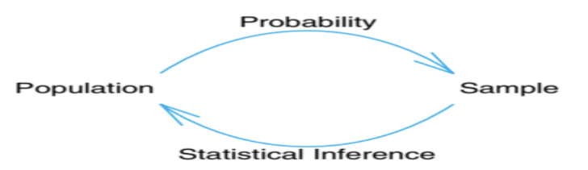
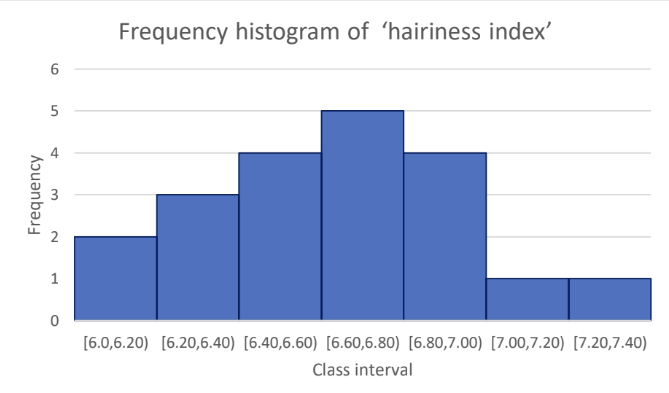

# Introduction to Statistics

- **Data:** Data consists of information coming from observations, counts, measurements, or responses. *(Ron Larson)*
- **Statistics:** Statistics is the science of collecting, organizing, analyzing, and interpreting data in order to make decisions. *(Ron Larson)*

## Data Sets

There are two types of data sets you will use when studying statistics: **populations** and **samples**.

- **Population:** The entire collection of objects or outcomes about which data are collected.
  - A **parameter** refers to a numerical quantity computed from a population.
- **Sample:** A subset of the population containing the observed objects or outcomes and the resulting data.
  - A **statistic** (rather than the field of "statistics") refers to a numerical quantity computed from sample data (e.g., the mean, the median, the maximum).

------------------------------------------------------------------------

## Branches of Statistics

The study of statistics has two major branches:

1.  **Descriptive Statistics:** Describes the important characteristics/properties of the data using measures of central tendency (mean, median, mode) and measures of dispersion (range, standard deviation, variance). Data can be summarized and represented using charts, tables, and graphs.

2.  **Inferential Statistics:** Uses data from a sample to make inferences about the larger population from which the sample was drawn. The goal is to draw conclusions from a sample and generalize them to the population using probability theory.

    Common methodologies include hypothesis tests and Analysis of Variance (ANOVA).

Figure 1 shows the fundamental relationship between probability and inferential statistics:

{width="466"}

## Application of Probability and Statistics in Engineering

- **Electrical Engineering:** Signals and noise are analyzed using probability theory.
- **Civil, Mechanical, & Industrial Engineering:** Used to test and account for variations in materials and goods.
- **Chemical Engineering:** Used to assess experimental data and control/improve chemical processes.

### Why Textile Engineers Study Statistics

Textile engineers study variations occurring from material to material, test to test, sample to sample, machine to machine, time to time, and place to place. Key questions include:

1.  How many tests are to be carried out to get the desired results?
2.  How to analyze the collected data?
3.  How to interpret the results of the analysis?

------------------------------------------------------------------------

## Types of Variables / Data

Data sets can consist of two types of data: **Qualitative (Categorical)** and **Quantitative**.

## Qualitative (Categorical) Variables

Consist of attributes, labels, or non-numerical entries. Values are intrinsically non-numeric. \* *Examples:* Cause of death, nationality, race, gender, severity of pain (mild, moderate, severe).

## Quantitative Variables

Consist of numerical measurements or counts where arithmetic operations make sense. \* *Examples:* Number of defective items, systolic blood pressure, height, age.

### Sub-divisions

- **Discrete Variables:** Have a set of possible values that is finite or countably infinite, with gaps between possible values. Often integer values/counts. *(e.g., number of pregnancies, shoe size)*
- **Continuous Variables:** Can take any value within an interval of the real line with no gaps. *(e.g., duration of a seizure, BMI, height)*

------------------------------------------------------------------------

## Data Collection and Experimental Design

**Guidelines for Designing a Statistical Study**

1.  Identify the variable(s) of interest and the target population.
2.  Develop a detailed plan for collecting data (ensure samples are representative).
3.  Collect the data.
4.  Describe the data using descriptive statistics.
5.  Interpret data and make decisions using inferential statistics.
6.  Identify possible errors.

## Observational Study vs. Experiment

- **Observational Study:** The researcher observes and measures characteristics of interest without influencing or changing existing conditions.
- **Experiment:** A treatment is deliberately applied to part of a population (treatment group) and responses are observed. A control group (often given a placebo) is used for comparison.

## Data Management & Arrays

Data management refers to processing steps occurring after collection but before analysis. Statistical software operates primarily on rectangular arrays where **rows = cases** and **columns = variables**.

**Example: Medical Expenditures Data Set**

```{r medical-data, echo=FALSE}

medical_df <- data.frame( ID = c(132414, 454543, 232134, 314132, 453255, 543545, 342342, 563654, 465566), Age = c(33, 25, 41, 55, 46, 35, 28, 41, 27), State = c("DHK", "CTG", "RAJ", "KHL", "CTG", "CTG", "BAR", "NOA", "DHK"), Expenditures = c(375, 1450, 908, 3480, 2480, 8550, 320, 24350, 1850) )

knitr::kable(medical_df, caption = "Typical Rectangular Data Set")
```

# 2.Frequency distribution

**1) Ungrouped (discrete)** - Usually used to understand the distribution of count data

**2) Grouped (continuous)** - Usually used to understand the distribution of scale data

**Example-1:** Construct the frequency distribution for the following data of number of weaving defects observed in the 30 pieces of fabric. 4, 0, 1, 5, 2, 6, 0, 4, 4, 1, 5, 4, 5, 4, 3, 0, 2, 3, 3, 2, 6, 4, 1, 2, 1, 3, 4, 3, 2, 3.

**Solution:** Here, Minimum= 0 Maximum=6

So, the frequency table/distribution of number of weaving defects is:

| Number of defects | Tally | Frequency |
|:-----------------:|:-----:|:---------:|
|         0         |       |           |
|         1         |       |           |
|         2         |       |           |
|         3         |       |           |
|         4         |       |           |
|         5         |       |           |
|         6         |       |           |

**Answer:**

| No. of defects | Freq |
|:--------------:|:----:|
|       0        |  3   |
|       1        |  4   |
|       2        |  5   |
|       3        |  6   |
|       4        |  7   |
|       5        |  3   |
|       6        |  2   |

**Example-2:** Following are the results of ‘hairiness index’ obtained from 20 tests: 6.72, 6.52, 6.00, 6.85, 6.08, 6.64, 6.88, 6.91, 6.35, 6.52, 6.26, 7.20, 7.12, 6.36, 6.82, 6.53, 6.78, 6.75, 6.49, 6.62. Construct the grouped frequency distribution by taking suitable/ appropriate class interval in exclusive method.

**Solution:** Here, Minimum=6.0; Maximum=7.2 ; Range, R= Maximum- Minimum=7.2-6.0=1.2; n = 20

So, class interval, c = $$c = \frac{R}{(1+3.32*\log_{10} n)} = \frac{1.2}{(1+3.32*\log_{10} 20)} = 0.23 \approx 0.20$$

Hence in exclusive method; required classes are: \[6.0,6.20), \[6.20, 6.40), \[6.40,6.60), \[6.60,6.80), \[6.80,7.00), \[7.00, 7.20), \[7.20, 7.40)

**Frequency distribution of hairiness index (n=20):**

| Class interval | Tally | Frequency |
|----------------|-------|-----------|
| \[6.0,6.20)    |       |           |
| \[6.20, 6.40)  |       |           |
| \[6.40,6.60)   |       |           |
| \[6.60,6.80)   |       |           |
| \[6.80,7.00)   |       |           |
| \[7.00, 7.20)  |       |           |
| \[7.20, 7.40)  |       |           |
| **Total**      |       |           |

| Class interval | Freq |
|:--------------:|:----:|
|    \[6,6.2)    |  2   |
|   \[6.2,6.4)   |  3   |
|   \[6.4,6.6)   |  4   |
|   \[6.6,6.8)   |  5   |
|    \[6.8,7)    |  4   |
|    \[7,7.2)    |  1   |
|   \[7.2,7.4)   |  1   |

*Histogram of ‘hairiness index’ data:*

{width="586"}

**Relative, percent and cumulative frequency distribution- example with the ‘hairiness index’ data**

| Class interval | Frequency | Relative frequency (rf) | Percent frequency(pf) | Cumulative frequency (cf) |
|---------------|---------------|---------------|---------------|---------------|
| \[6.0,6.20) | 2 | 0.10 | 10 | 2 |
| \[6.20,6.40) | 3 | 0.15 | 15 | 5 |
| \[6.40,6.60) | 4 | 0.20 | 20 | 9 |
| \[6.60,6.80) | 5 | 0.25 | 25 | 14 |
| \[6.80,7.00) | 4 | 0.20 | 20 | 18 |
| \[7.00,7.20) | 1 | 0.05 | 5 | 19 |
| \[7.20,7.40) | 1 | 0.05 | 5 | 20 |
| **Total** | **20** | **1.00** | **100.00** |  |

## 2. Exercise

1.  Construct the frequency distribution for the following data of number of weaving defects observed in the 30 pieces of fabric. 4, 0, 1, 5, 2, 6, 0, 4, 4, 1, 5, 4, 5, 4, 3, 0, 2, 3, 3, 2, 6, 4, 1, 2, 1, 3, 4, 3, 2, 3

2.  Construct the ungrouped frequency distribution for the following data of number of end breaks observed on a ring frame for the 30 days. 10, 8, 5, 10, 7, 7, 11, 8, 10, 12, 11, 12, 6, 6, 7, 10, 10, 12, 10, 10, 6, 7, 8, 10, 8, 8, 12, 11, 10, 10

3.  Following are the figures of number of workers absent in a textile mill every day: 2, 3, 1, 1, 2, 3, 2, 0, 0, 1, 2, 5, 0, 0, 2,1, 1, 4, 3, 2, 0, 2, 1, 2, 2, 4, 3, 3, 3, 4 Construct the ungrouped frequency distribution for the above data.

\*\*4. Following are the results of ‘hairiness index’ obtained from 20 tests: 6.72, 6.52, 6.00, 6.85, 6.08, 6.64, 6.88, 6.91, 6.35, 6.52, 6.26, 7.20, 7.12, 6.36, 6.82, 6.53, 6.78, 6.75, 6.49, 6.62 Construct the grouped frequency distribution by taking classes 6.00–6.20, 6.20–6.40 and so on.

5.  Following are the number of accidents per day observed in a textile mill during a month of 30 days: 4, 3, 3, 3, 4, 2, 2, 1, 2, 0, 2, 3, 4, 1, 1, 2, 0, 0, 5, 2, 1, 0, 0, 2, 3, 2, 1, 1, 3, 2. Construct an ungrouped frequency distribution.

\*\*5. Following are the number of accidents per day observed in a textile mill during a month of 30 days: 4, 3, 3, 3, 4, 2, 2, 1, 2, 0, 2, 3, 4, 1, 1, 2, 0, 0, 5, 2, 1, 0, 0, 2, 3, 2, 1, 1, 3, 2. Construct an ungrouped frequency distribution.

6.  Thirty pieces of fabric were observed for the number of defects and following results were obtained. 1, 0, 0, 2, 3, 2, 1, 1, 3, 2, 4, 3, 4, 1, 1, 2, 0, 0, 5, 2, 3, 3, 4, 2, 2, 1, 2, 0, 2, 3 Construct an ungrouped frequency distribution.

7.  Construct the frequency distribution for the following results of the daily sale (in 1000 Rs.) in a textile firm recorded for a month. 21, 21, 21, 22, 26, 20, 20, 20, 21, 21, 20, 20, 22, 20, 21, 23, 21, 22, 21, 25, 18, 24, 25, 19, 25, 18, 26, 23, 18, 24

\*\*8. Thirty linear density tests made on the yarn have shown following results. 14.8, 14.2, 13.8, 13.5, 14.0, 14.2, 14.3, 14.6, 13.9, 14.0, 14.1, 13.2, 13.0, 14.2, 13.5, 13.0, 12.8, 13.9, 14.8, 15.0, 12.8, 13.4, 13.2, 14.0, 13.8, 13.9, 14.0, 14.0, 13.9, 14.8 Construct the grouped frequency distribution by taking class intervals 12.6–13.0; 13.1–13.5 and so on.

9.  Following is the distribution of fabric samples according to the strength of fabric:

| Strength           | 150–155 | 155–160 | 160–165 | 165–170 | 170–175 |
|--------------------|---------|---------|---------|---------|---------|
| **No. of samples** | 8       | 12      | 17      | 10      | 7       |

Draw the histogram for the above data and interpret it.
